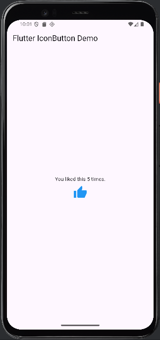

# Flutter IconButton Demo

A simple Flutter app that shows how to use the `IconButton` widget to let users interact with an icon.

## Features

- A large thumbs-up icon that users can tap
- Each tap increases a visible counter
- Built using `StatefulWidget` and `setState()` to handle updates

## What You'll Learn

- How to use the `IconButton` widget in Flutter
- How to react to user taps using the `onPressed` property
- Updating the UI based on internal state

## IconButton: Key Attributes

| Attribute    | Description |
|--------------|-------------|
| `icon`       | The icon to display (e.g., `Icons.thumb_up`) |
| `onPressed`  | Called when the icon is tapped |
| `tooltip`    | Text shown on long press (for accessibility) |

## How to Run

1. Clone this repo:
```bash
git clone https://github.com/denismitali17/flutter-iconbutton-demo
cd flutter-iconbutton-demo
```

2. Install dependencies:
```bash
flutter pub get
```

3. Run on an emulator or connected device:
```bash
flutter run
```

## Screenshot




## Author

Denis Mitali 